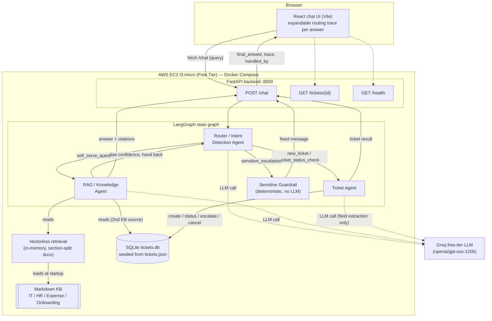

# HelpBot — High-Level Design

## 1. Problem & Goal

Nimbus Corp's internal helpdesk gets a mix of: questions already answered in policy docs,
genuinely new issues, and check-ins on tickets already raised. HelpBot sits in front of this
flow and, for every employee query, decides which of those three things it's looking at and
acts accordingly — answering directly with a citation, raising a ticket, or looking up/acting
on an existing one — instead of a human triaging every message by hand.

## 2. Architecture Overview

Three specialized agents, orchestrated as a LangGraph state graph, share one state object as
the query moves through the system:

```
                         ┌───────────────────────┐
                         │   Router / Intent      │
             ┌──────────▶│   Detection Agent      │◀────────────┐
             │           └───────────┬────────────┘             │
             │                       │                           │ low-confidence
             │        ┌──────────────┼───────────────┐           │ hand-back
             │        ▼              ▼               ▼           │
             │  ┌────────────┐ ┌────────────┐ ┌───────────────┐  │
             │  │  Sensitive │ │  RAG /     │ │  Ticket Agent │  │
             │  │  Guardrail │ │  Knowledge │ │  (create /    │──┘
             │  │ (fixed msg)│ │  Agent     │─┼─ status /     │
             │  └─────┬──────┘ └─────┬──────┘ │  escalate /   │
             │        │              │(answered)│  cancel)     │
             │        ▼              ▼        └───────┬───────┘
             │       END            END                ▼
             │                                         END
             └─────────────────────────────────────────
```

Full annotated diagram including the frontend, API layer, and data stores (also kept in sync at
`architecture.mmd` for mermaid.live):



### Why LangGraph, and why this shape

Every routing decision needs to be an explicit, inspectable edge in a graph — not a decision
buried inside one long prompt — because the assignment specifically calls out "not three
functions called sequentially inside one script pretending to be agents." LangGraph gives us:

- A typed, shared `HelpBotState` object that every node reads/writes (see LLD for the schema),
  so the full reasoning trail (intent, confidence, which ticket, which citations) is visible at
  the end of a run, not just the final text.
- Conditional edges as the actual routing logic (`router_agent.route_decision`,
  `graph.rag_decision`), so "if confidence is low, hand back to the router" is a real graph edge,
  not something re-implemented ad hoc.
- A natural place to add a cycle: RAG agent → router → Ticket agent is a genuine loop in the
  graph (guarded by a `rag_attempted` flag so it can only happen once per query).

## 3. The Three Agents

| Agent | Responsibility | Notes |
|---|---|---|
| **Router / Intent Detection** | Classifies every incoming query (and every RAG hand-back) into `self_serve_question`, `new_ticket`, `ticket_status_check`, or `sensitive_escalation`. Extracts `ticket_id` / requested action up front for status checks. | Single LLM call, strict JSON output. Fails safe: unparseable output routes to ticket creation rather than guessing. |
| **RAG / Knowledge Agent** | Retrieves from the policy docs + resolved tickets, self-assesses confidence, answers with citations if confident enough, otherwise hands back to the router. | Vectorless, reasoning-based retrieval (see §4). Confidence threshold is a tunable config value (`RAG_CONFIDENCE_THRESHOLD`, default 0.55). |
| **Ticket Agent** | All ticket operations: create (from a new issue, or a RAG low-confidence fallback), status lookup, escalate, cancel. Talks to a real SQLite-backed store via LangChain tools — not generated text. | Field extraction (category/subject/description) is one LLM call; everything after that is deterministic Python dispatch, per the brief's instruction to keep this agent simple and deterministic. |

A fourth node, the **sensitive guardrail**, is *not* counted as one of the three agents — it
makes no LLM call and does no reasoning about content. It's a deterministic safety
short-circuit required by `hr-faq.md` §4 ("Automated systems, including HelpBot, are not
authorized to advise on, mediate, or document grievance matters"). The router is responsible
for detecting this category and routing to it; the guardrail itself just returns a fixed,
policy-compliant message pointing to a human HR rep / the Ethics Hotline, and never creates a
ticket containing the details of the complaint.

## 4. Retrieval Strategy: Vectorless, Reasoning-Based

The knowledge base is 4 short markdown documents (~180 lines total) plus 14 resolved tickets —
comfortably within a single LLM context window. Rather than embedding + vector-DB similarity
search, the RAG agent is given the *entire* corpus (split into `##`-heading sections and
tagged with an id) in one prompt, and asked to (a) decide which sections are relevant, (b)
answer using only them, (c) cite them, and (d) self-report a confidence score.

**Why this over vector search here:**
- The content pack deliberately plants a contradiction between two documents (the expense
  claim deadline is 30 days generally, but 45 days for onboarding-related claims). Top-k
  similarity search over isolated chunks tends to surface only one side of a fact like this;
  a reasoning pass that sees the whole corpus at once can notice the conflict and say so
  explicitly, which is exactly the behavior the assignment is testing for.
- Standing up a vector DB (pgvector/Qdrant) to index ~30 short sections is disproportionate
  infrastructure for this corpus size, and doesn't fit cleanly inside an AWS Free-Tier
  deployment.

**Where this breaks down:** this approach doesn't scale — a corpus of hundreds of documents
would blow the context window and get expensive per query. At that point the right design is
a hybrid: cheap embedding-based pre-filtering down to a candidate set, then this same
LLM-reasoning pass over just that candidate set (conceptually what PageIndex does at the
section/tree-node level). This is called out as a known limitation in `writeup.md`.

## 5. Data Flow (happy paths)

1. **Self-serve question** → Router (`self_serve_question`) → RAG agent retrieves + answers
   with citations → END. If confidence is below threshold → RAG agent hands back to Router
   (flagged `rag_attempted`) → Router re-routes to Ticket agent → ticket created, user told why.
2. **New issue/request** → Router (`new_ticket`) → Ticket agent extracts fields → creates
   ticket via `create_ticket_tool` → END.
3. **Existing ticket action** → Router (`ticket_status_check`, with `ticket_id` + `action`
   already extracted) → Ticket agent calls the matching tool (`get_ticket_status_tool` /
   `escalate_ticket_tool` / `cancel_ticket_tool`) → END. A ticket ID that doesn't exist returns
   `{"found": false}` from the tool, and the agent tells the user rather than fabricating a
   status.
4. **Grievance/harassment query** → Router (`sensitive_escalation`) → guardrail → fixed message
   → END. Never reaches RAG or Ticket agent.

## 6. Tech Stack & Why

| Layer | Choice | Why |
|---|---|---|
| Orchestration | LangGraph | Required by the brief; gives explicit, inspectable state + routing. |
| LLM | Groq free tier (`openai/gpt-oss-120b`) | Free-tier only, per requirement. Groq's free-tier throughput comfortably supports the 1–2 LLM calls per agent hop this graph needs; provider is swappable via `LLM_PROVIDER` in `config.py`. Groq periodically retires models (this replaced an earlier `llama-3.3-70b-versatile` default once that endpoint was removed), so `GROQ_MODEL` is env-configurable rather than hardcoded. |
| Retrieval | Vectorless / reasoning-based (see §4) | Corpus is small; better handles the deliberate cross-doc inconsistency; avoids extra infra. No vector DB needed, so no pgvector/Qdrant dependency. |
| Ticket store | SQLite, seeded from `tickets.json` | Zero infrastructure, file-based, fully Free-Tier compatible; ticket actions are real writes, not re-reads of static JSON. |
| Backend | FastAPI | Required by the brief; thin layer exposing `/chat` and `/tickets/{id}`. |
| Frontend | React (Vite) | Required by the brief; single-page chat UI with an expandable "routing trace" per answer so the multi-agent handoff is visible, not hidden. |
| Deployment | Docker Compose on a single AWS EC2 t3.micro (Free Tier eligible) | Two containers (backend, frontend via nginx), no auto-scaling, no managed DB — stays inside Free Tier. See `README.md` for the exact steps. |

## 7. What's Explicitly Out of Scope (per the brief)

- Duplicate/similar-ticket detection in the Ticket Agent — explicitly not required; kept simple
  and deterministic.
- Multi-turn conversation memory across separate chat sessions — each `/chat` call is a single
  independent query/response (see `writeup.md` for the tradeoff).
